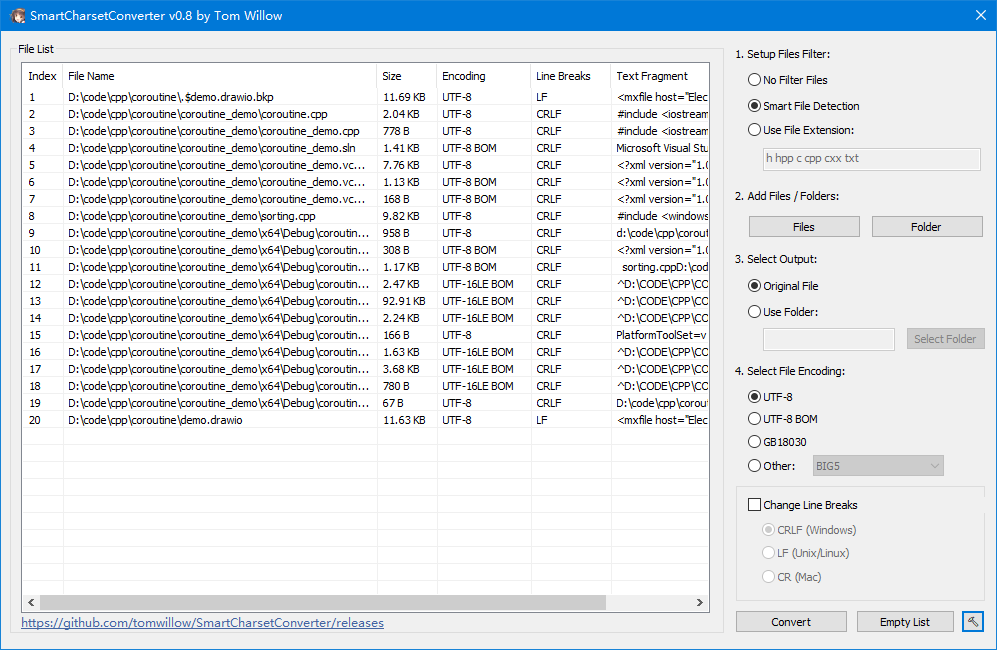

# SmartCharsetConverter

[English](README-en.md) / [Chinese](README.md)

This program is used to automatically detect the encoding of files and convert its encoding to UTF-8/UTF-8 BOM/GB18030 etc.

Function:

- Batch conversion to UTF-8/UTF-8 BOM/GB18030, etc.
- Convert line breaks to CRLF/LF/CR
- Check whether characters are lost to ensure that the conversion process is reversible
- Support command line (use $ ./SmartCharsetConverter --help for details)
- Multi-language support (click the "hammer" button in the bottom right corner to switch languages)
- Support Vietnamese charset(VNI/VPS/VISCII/TCVN3)（Currently unable to detect these charset. please use the "No File Filter" mode）

Supported Platform:

- Win10 x64
- Win7 x64 (haven’t tried it yet)

# Download

[https://github.com/tomwillow/SmartCharsetConverter/releases](https://github.com/tomwillow/SmartCharsetConverter/releases)

# Special Advantage

Charset detection is a well-known and difficult problem.

Therefore, most of the charset convert programs are GBK->UTF-8, GBK->BIG5. In this case, you must know what encoding your text is in advance, otherwise it will be garbled. Moreover, text that has been converted once will be garbled if it is converted again.

After comparing many charset detection libraries, I selected the modified version of uchardet used by Notepad3. This modified version of uchardet has been carefully tuned by the author of Notepad3, and its accuracy is higher than the original uchardet! I also used the charset detection function provided by the icu library, and combines the comprehensive judgment of uchardet+icu to give the detection result!

Although it cannot be said that the character set detection is 100% correct, the accuracy rate is also very high! You will know exactly how high it is when you try it.

Precisely because the biggest problem of character set detection is solved, all the problems of the "traditional transcoding program" mentioned above do not exist in this program! It doesn’t matter what character set you originally used, just say what you want!

# Version

v0.1 Implements basic functions: can detect charset and convert

v0.2 Add windows-1252 support. Add the option of "No Filter Files" and "Smart File Detection".

v0.3 "Add Folder" can now remember the last selected path. The list box now supports dragging in files and folders.

v0.4 Fix the bug "Reason: ucnv error. code=15". Added ISO-8859-1 support.

v0.41 Fix the bug where only BOM text recognition is wrong. Now empty text will not report an error.

v0.5 Now you can cancel midway when dragging a large number of files to the list box. Now you can click the Cancel button during the conversion.

v0.51 Add multiple supported charset: Big5, SHIFT-JIS, etc.

v0.6 Check if characters will be lost when converting.

v0.61 Select "No File Filter" mode to forcely join files. Right-click items in the list box can select Original Encoding.

v0.62 Support dragging files/folders to the program icon.

v0.7 Support command line. Use $ ./SmartCharsetConverter --help to view the command line parameters.

v0.71 Fix the bug that the command line not work.

v0.72 solves the problem of getting stuck when adding large files (only the first 100KB of the file is detected).
The extension filter mode now supports more patterns (supports separation by `*.` `.` `space` `|`). Fixed other issues with extension filtering mode.

v0.8 Rearrange the interface (thanks to [Carlos Sánchez](https://github.com/c-sanchez)).
Add configuration file, and changing settings will trigger the saving of configuration file.
Support multiple languages (built-in Simplified Chinese and English).
Add multi-language selection(to click "hammer" button - Language).

v0.81 Add Spanish language pack support (thanks to [Carlos Sánchez](https://github.com/c-sanchez)).

v0.82 Check if characters will be lost when specifying encoding manually.

v0.9 Support multiple Vietnamese charset converting: VNI/VPS/VISICII/TCVN3

v0.9.1 bugfix: fixed the error of "ucnv error. code=11" due to invalid trucated string piece.

# Build

1. Confirm the compilation environment: win10+ x64, Visual Studio 2019+, cmake.
2. Install vcpkg and set correct environment variable VCPKG_ROOT.
3. Execute config_on_win.bat to generate .sln.
4. Open ./build/SmartCharsetConverter.sln.

# Add language pack

> Language packs only affect the interface of the program and have nothing to do with the functions of the program.

If you want to add a new language pack to this program, you can follow these steps:

1. Find the xxx.json files under src/Resource/lang_embed.
2. Copy the xxx.json file and modify its content. The new json file can be rename arbitrarily, because the program does not depend on the file name of the language file.

> The xxx.json file must be UTF-8 encoding.

3. Modify the `langId` field: Download the pdf from [[MS-LCID]: Windows Language Code Identifier (LCID) Reference](https://learn.microsoft.com/en-us/openspecs/windows_protocols/ms-lcid/70feba9f-294e-491e-b6eb-56532684c37f?redirectedfrom=MSDN), find the section `2.2 LCID Structure - Language ID (2 bytes)`, and find the Language ID corresponding to the target language. `For example: 0x409 corresponds to en-US, 0x804 corresponds to zh-CN. `Then convert hexadecimal to decimal and fill in the `langId` field. `For example, 0x409 is filled in with 1033, and 0x804 is filled with 2052`.
   This Language ID is related to the user's operating system. If filled in correctly, the corresponding language file will be automatically loaded according to the operating system settings when the program starts (the prerequisite is that the language has not been set in the configuration file. If the language has been set in, the `language` field at the configuration file is preferred).
4. Place your xxx.json language file in the `lang` directory of the directory where SmartCharsetConverter.exe is located (if it does not exist, create a new). The program will automatically check and load it when it starts.

> Note: There are some language packages built into the program (located in `src/Resource/lang_embed`). If the `language` field of the language package in the lang directory is the same as one built-in language package, the external language package json file will be preferred.

Now you can launch the program and see the results!

> If you want to make your language pack built into the program, you can submit a pull request or contact the author (tomwillow@qq.com) to make it built-in.

# TODO

- Check the character set again before conversion to avoid conversion errors after the user changes the character set after loading.
- Add "Convert to xxx encoding" to the right-click menu to enable manual converting of single/multiple files.
- Add a refresh button.
- Add maximize/minimize buttons, and flexibly control the size of ListView while resizing.
- Add the main menu bar to display menu items such as "Settings", "About".
- Replace the error MessageBox to a custom Dialog for displaying the complete error information and allow copy operation.

# Reference

[ICU](https://icu.unicode.org/)

[WTL](https://sourceforge.net/projects/wtl)

[uchardet](https://github.com/rizonesoft/Notepad3/tree/master/src/uchardet)

# Thanks

Thanks to [Carlos Sánchez](https://github.com/c-sanchez) for providing the interface design and Spanish language pack.

# E-mail

tomwillow@qq.com

# WeChat Group

If you have any questions or suggestions, please feel free to add the author on WeChat `tomwillow`. Note: "SmartCharsetConverter" is introduced into the group according to the guidelines.

If you think this project is good, please give it a star!
