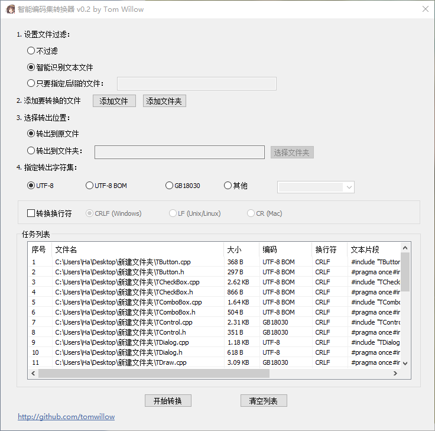

# 智能编码集转换器

本程序用于自动识别文件夹下所有文本文件，自动识别原编码（不必担心反复转码出错了），批量转换到UTF-8等字符集。

功能：

* 批量转UTF-8/UTF-8 BOM/GB18030等
* 批量转CRLF/LF/CR换行符
* 转换时会检查是否丢失字符，确保转换过程可逆
* 支持命令行（使用 $ ./SmartCharsetConverter --help 查看）

运行要求：

* Win10 x64
* Win7 x64（理论上可以，没尝试）

# 特别优点

字符集探测是著名的老大难问题，就是说，怎样在不知道字符编码的情况下，探测出文本是什么编码，什么字符集。这个问题很难。

所以，你看到的绝大多数转字符集的程序，都是GBK->UTF-8，GBK->BIG5，这种，必须要你提前知道你的文本是什么编码，否则就会乱码。而且，转过一次的文本，再转一次，也会乱码。

我在对比了诸多字符集探测库之后，选定了Notepad3使用的魔改版uchardet，这个魔改版uchardet经过Notepad3作者精心调教，精度比原版uchardet更高！

虽然不能说做到百分百地把字符集探测正确，但正确率也是非常高的！具体多高你试试就知道了。

也正因为解决了字符集探测这个最大的问题，所以上面提到的这些“传统转码程序”的问题，在本程序中通通都不存在！不用管你原来是什么字符集，你只说你要什么就行啦！

# 版本记录

v0.1 实现基本功能：可以探测字符集，转换字符集

v0.2 增加windows-1252支持。文件现在可以选择“不过滤”和“智能识别”。

v0.3 “添加文件夹”现在可以记住上一次选的路径了。现在列表框支持拖入文件和文件夹了。

v0.4 修复“原因: ucnv出错。code=15”的bug。增加ISO-8859-1支持。

v0.41 修复只有BOM的文本识别出错的bug。现在空文本不会报错了。

v0.5 现在拖动大量文件到列表框时可以中途取消了。现在转换中途可以点取消按钮了。

v0.51 增加多个支持的字符集：Big5, SHIFT-JIS等。

v0.6 现在转换时会检查是否会丢失字符。

v0.61 现在选择“不过滤”模式可以强行加入文件。并且，在列表框里右键-指定原编码 可以手动指定字符集。

v0.62 现在支持拖拽文件/文件夹到程序图标上了。

v0.7 支持命令行。使用 $ ./SmartCharsetConverter --help 查看命令行参数。

# TODO

* 转换前再次检查一次字符集，已免出现加载后用户更改了字符集后转换出错的情况。
* 右键菜单加入“转换到xxx编码”，以实现单个/多个文件手动转码。
* 增加一个刷新按钮。
* 使用ini文件保存配置。

# 构建方法

1. 确认编译环境：win10+ x64, Visual Studio 2019+, cmake。
2. 下载 icu4c-71_1-Win64-MSVC2019.zip 并解压。
3. 修改 build_on_win32.bat 以适配你的 icu4c lib位置。
4. 双击 build_on_win32.bat 生成.sln。
5. 打开 output/SmartCharsetConverter.sln。

# Reference

[ICU](https://icu.unicode.org/)

[WTL](https://sourceforge.net/projects/wtl)

[uchardet](https://github.com/rizonesoft/Notepad3/tree/master/src/uchardet)

# E-mail

tomwillow@qq.com

# 微信交流群

如果您在使用中有疑问，或者有意见建议，欢迎加作者微信tomwillow。备注“智能编码集转换器”按照指引进群。

如果您觉得此项目不错，请赏颗星吧！
