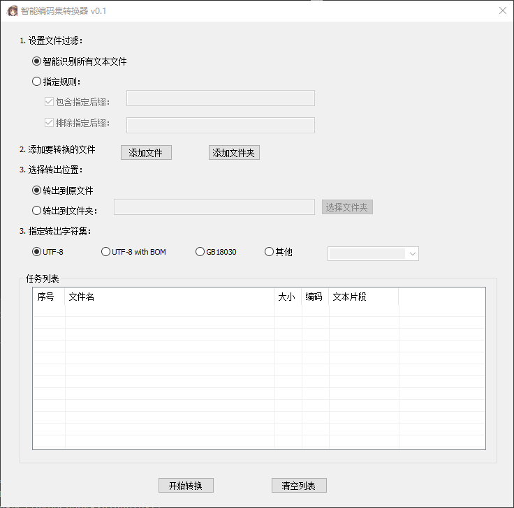

# 智能编码集转换器（uncompleted）

本程序用于自动识别文件夹下所有文本文件，自动识别原编码（不必担心反复转码出错了），批量转换到UTF-8等字符集。

运行要求：Win10 (不支持MAC, Linux)

# Reference

[WTL](https://sourceforge.net/projects/wtl)

[uchardet](https://github.com/freedesktop/uchardet)
