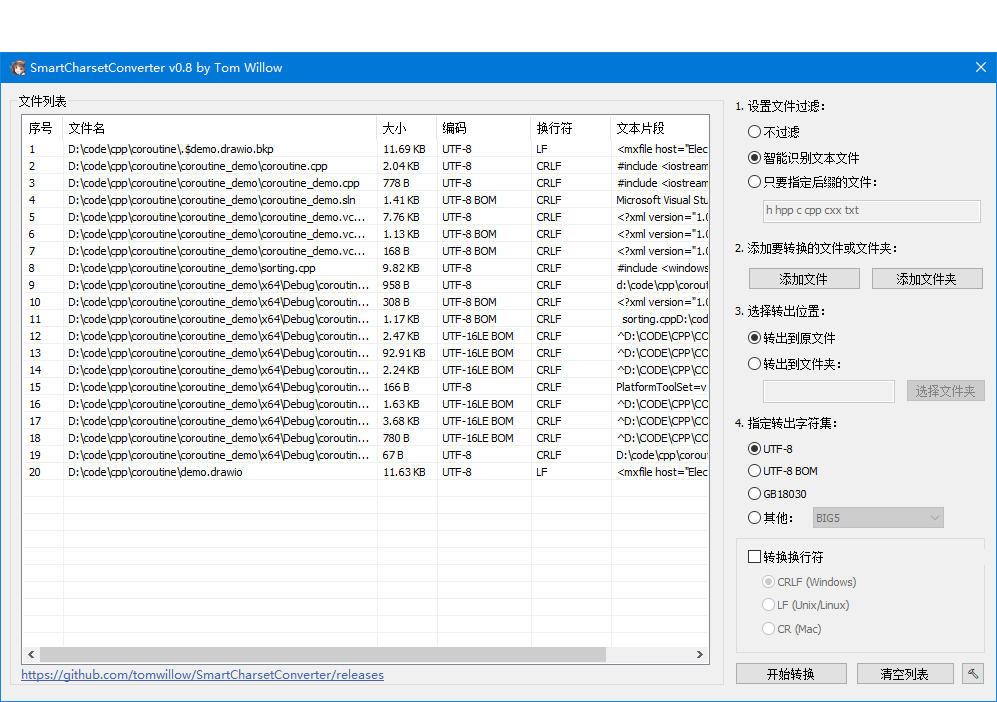

# 智能编码集转换器

[English](README-en.md) / [Chinese](README.md)

本程序用于自动识别文件夹下所有文本文件，自动识别原编码（不必担心反复转码出错了），批量转换到UTF-8等字符集。

功能：

* 批量转UTF-8/UTF-8 BOM/GB18030等
* 批量转CRLF/LF/CR换行符
* 转换时会检查是否丢失字符，确保转换过程可逆
* 支持命令行（使用 $ ./SmartCharsetConverter --help 查看）
* 多语言支持（点击右下角“锤子”按钮切换语言）

运行要求：

* Win10 x64
* Win7 x64（理论上可以，没尝试）

# 特别优点

字符集探测是著名的老大难问题，就是说，怎样在不知道字符编码的情况下，探测出文本是什么编码，什么字符集。这个问题很难。

所以，你看到的绝大多数转字符集的程序，都是GBK->UTF-8，GBK->BIG5，这种，必须要你提前知道你的文本是什么编码，否则就会乱码。而且，转过一次的文本，再转一次，也会乱码。

我在对比了诸多字符集探测库之后，选定了Notepad3使用的魔改版uchardet，这个魔改版uchardet经过Notepad3作者精心调教，精度比原版uchardet更高！并且又使用了icu库提供的字符集探测功能，结合uchardet+icu两者综合判断给出探测结果！

虽然不能说做到百分百地把字符集探测正确，但正确率也是非常高的！具体多高你试试就知道了。

也正因为解决了字符集探测这个最大的问题，所以上面提到的这些“传统转码程序”的问题，在本程序中通通都不存在！不用管你原来是什么字符集，你只说你要什么就行啦！

# 版本记录

v0.1 实现基本功能：可以探测字符集，转换字符集

v0.2 增加windows-1252支持。文件现在可以选择“不过滤”和“智能识别”。

v0.3 “添加文件夹”现在可以记住上一次选的路径了。现在列表框支持拖入文件和文件夹了。

v0.4 修复“原因: ucnv出错。code=15”的bug。增加ISO-8859-1支持。

v0.41 修复只有BOM的文本识别出错的bug。现在空文本不会报错了。

v0.5 现在拖动大量文件到列表框时可以中途取消了。现在转换中途可以点取消按钮了。

v0.51 增加多个支持的字符集：Big5, SHIFT-JIS等。

v0.6 现在转换时会检查是否会丢失字符。

v0.61 现在选择“不过滤”模式可以强行加入文件。并且，在列表框里右键-指定原编码 可以手动指定字符集。

v0.62 现在支持拖拽文件/文件夹到程序图标上了。

v0.7 支持命令行。使用 $ ./SmartCharsetConverter --help 查看命令行参数。

v0.71 修复命令行用不了的bug。

v0.72 解决添加大文件会卡死的问题（只探测文件前100KB）。
      后缀过滤模式现在支持更多的模式了（支持以`*.` `.` `空格` `|`分隔）。修复后缀过滤模式的其他问题。

v0.8 重新编排界面(感谢[Carlos Sánchez](https://github.com/c-sanchez))。
      增加配置文件，现在界面改动会保留在配置文件中了。
      支持多语言（内置简体中文和英文）。增加多语言选择。

# 构建方法

1. 确认编译环境：win10+ x64, Visual Studio 2019+, cmake。
2. 安装 vcpkg。
3. 修改 build_on_win32.bat 以适配你的 vcpkg 安装目录。
4. 执行 build_on_win32.bat 生成.sln。
5. 打开 ../build_SmartCharsetConverter/SmartCharsetConverter.sln。

# 添加语言包

> 语言包只影响程序的界面，和程序的功能无关。

如果您想为本程序添加新的语言包，可以遵循以下步骤：

1. 在src/Resource/lang_embed下找到xxx.json文件。
2. 复制xxx.json文件并修改内容。文件名可以随意取，程序并不依赖语言文件的文件名。
> xxx.json文件必须是utf-8编码。
3. 修改内容时注意langId字段，从[[MS-LCID]: Windows Language Code Identifier (LCID) Reference](https://learn.microsoft.com/en-us/openspecs/windows_protocols/ms-lcid/70feba9f-294e-491e-b6eb-56532684c37f?redirectedfrom=MSDN)处下载pdf，翻阅至`2.2  LCID Structure - Language ID (2 bytes)`一节，找到目标语言对应的Language ID。`例如：0x409对应于en-US，0x804对应于zh-CN。`然后把16进制转换为10进制填入langId字段。`例如0x409则填入1033，0x804则填入2052`。
      这个Language ID和操作系统设置有关，正确填写的话，程序启动时会根据操作系统设置自动加载对应的语言文件（前提条件是没有在程序中设置过语言，如果在程序中设置过语言，那么以设置的为准）。
> 如果你不知道langId应该填什么，那么可以填0。
4. 把你的xxx.json语言文件放置在SmartCharsetConverter.exe所在目录的lang目录(如果没有则新建一个)下，程序启动时会自动检查并加载。
> 注意：程序中内置了一些语言包（位于`src/Resource/lang_embed`)，如果lang目录下的语言包的language字段和内置的某个语言包一样，那么程序在启动时将以lang目录下的语言包文件为准。

现在你可以启动程序查看效果了！

> 如果想要让程序内置你的语言包，可以提pull requests或者联系作者(tomwillow@qq.com)来给你内置。

# TODO

* 转换前再次检查一次字符集，已免出现加载后用户更改了字符集后转换出错的情况。
* 右键菜单加入“转换到xxx编码”，以实现单个/多个文件手动转码。
* 增加一个刷新按钮。
* 添加最大化/最小化按钮，程序缩放时弹性控制ListView的大小。
* 添加菜单栏以显示“设置”“关于”等菜单项。
* 报错的MessageBox修改为自定义的Dialog，以显示完整的报错信息，并且允许从中复制内容。

# Reference

[ICU](https://icu.unicode.org/)

[WTL](https://sourceforge.net/projects/wtl)

[uchardet](https://github.com/rizonesoft/Notepad3/tree/master/src/uchardet)

# 致谢

感谢[Carlos Sánchez](https://github.com/c-sanchez)提供的界面设计。

# E-mail

tomwillow@qq.com

# 微信交流群

如果您在使用中有疑问，或者有意见建议，欢迎加作者微信tomwillow。备注“智能编码集转换器”按照指引进群。

如果您觉得此项目不错，请赏颗星吧！
